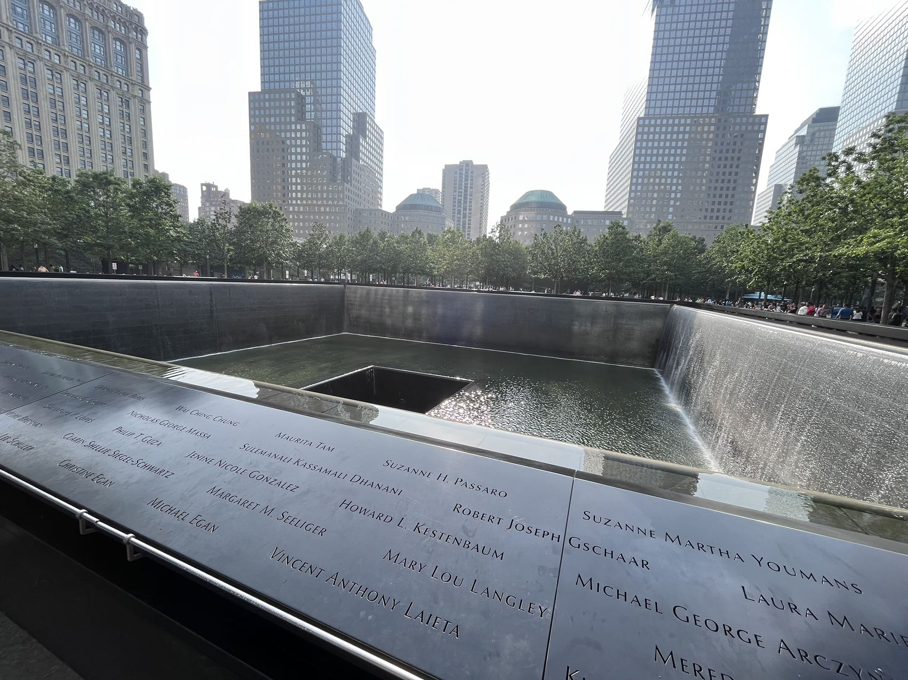

---
layout: post
title: "Yeah, July 4th"
author: "Gallon Liu"
categories: blog
tags: [sample]
image: worldtradecenter1.jpg
---

I had my first experience of watching fireworks on a magical July 4th evening. With my human companions by my side, I couldn't help but feel a mix of excitement and trepidation.
The burst of colors and the crackling sounds fascinated me, but at the same time, the loud booms startled me. My ears perked up, and I found solace in snuggling closer to my humans for comfort. 
Though a part of me was a bit scared, the beauty and wonder of the fireworks captivated me, and I couldn't help but wag my tail in awe. 
With each explosion, I found myself becoming more accustomed to the spectacle, and the fear slowly turned into a mixture of curiosity and joy. 
As the grand finale painted the sky with its brilliant finale, I barked with delight, experiencing the thrill of this newfound tradition. 

Watching fireworks on July 4th was an enchanting and slightly nerve-wracking adventure that I'll always cherish as a small dog.

